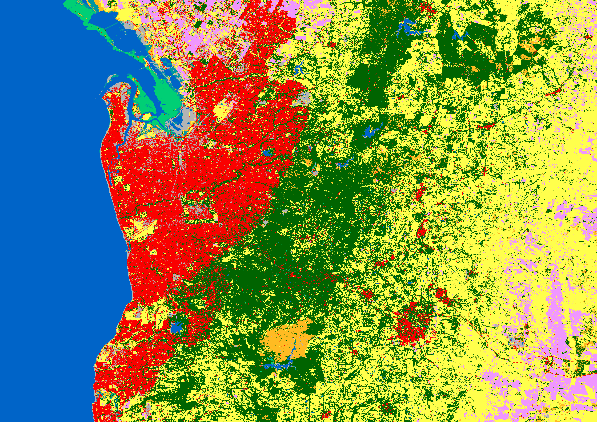

<div align="center">

# 🛰️ Sentinel-2 LULC Classification

### Satellite-based Land Use / Land Cover mapping powered by multi-seasonal Sentinel-2 imagery and a tuned XGBoost pipeline

[](https://www.python.org/)
[](https://xgboost.readthedocs.io/)
[](https://earthengine.google.com/)
[](https://jupyter.org/)
[]()

<br>

**🎯 ~89% Accuracy&nbsp; · &nbsp;📊 0.89 Macro F1&nbsp; · &nbsp;🗺️ 9 Land Cover Classes&nbsp; · &nbsp;🌦️ 4 Seasons&nbsp; · &nbsp;📦 90,000 Samples**

</div>

<br>

<p align="center">
  
  &nbsp;&nbsp;
  
</p>
<p align="center"><sub><b>Left</b> — model-classified land cover &nbsp;|&nbsp; <b>Right</b> — true-color Sentinel-2 reference &nbsp;|&nbsp; Adelaide region, South Australia</sub></p>

<br>

## 📋 Table of Contents

- [Overview](#-overview)
- [Results at a Glance](#-results-at-a-glance)
- [Land Cover Classes](#️-land-cover-classes)
- [Final Model](#-final-model)
- [Repository Structure](#-repository-structure)
- [How It Works](#️-how-it-works)
- [Getting Started](#-getting-started)
- [Tech Stack](#️-tech-stack)
- [Future Work](#-future-work)
- [License](#-license)

<br>

## 🔭 Overview

> A complete, reproducible remote-sensing pipeline — from raw satellite imagery to a deployable land cover classifier.

| | |
|---|---|
| 📍 **Study Area** | Adelaide & surrounds, South Australia (`138.35°E–139.10°E`, `34.50°S–35.30°S`) |
| 🛰️ **Imagery** | Sentinel-2 L2A (`COPERNICUS/S2_SR_HARMONIZED`), cloud-masked via Cloud Score+ |
| 🏷️ **Ground Truth** | [ESA WorldCover v200](https://esa-worldcover.org/) @ 10 m resolution |
| 🌦️ **Temporal Coverage** | 4 seasonal median composites (Q1–Q4, 2021) |
| 📡 **Spectral Input** | 10 bands × 4 seasons |
| 🤖 **Final Model** | Hyperparameter-tuned XGBoost classifier |

The project was built incrementally across **four controlled experiments**, each isolating one variable — feature engineering, dataset size, or seasonality — before converging on a final, tuned model. Full methodology and results: [`Final_Project_Report.pdf`](Final_Project_Report.pdf).

<br>

## 📊 Results at a Glance

<div align="center">

| Stage | Description | Features | Samples | Classes | RF Acc. | XGB Acc. |
|:---:|---|:---:|:---:|:---:|:---:|:---:|
| `EXP-01` | Baseline — raw bands (4 seasons) | 40 | 27,000 | 9 | 85.00% | 87.02% |
| `EXP-02` | + Spectral indices & temporal features | 55 | 20,963 | 7 | 87.00% | 88.00% |
| `EXP-03` | Sample-size scaling test (1 season) | 10 | 90,000 | 9 | 85.00% | 84.74% |
| `EXP-04a` | Multi-season, raw bands only | 40 | 90,000 | 9 | 87.00% | **88.21%** |
| `EXP-04b` | Multi-season, raw bands **+ 28 indices**¹ | 68 | 90,000 | 9 | 87.00% | — |
| 🏆 `FINAL` | **Tuned XGBoost — 40 multi-seasonal bands** | **40** | **90,000** | **9** | — | **~89.00%** |

<sub>¹ EXP-04b only tested Random Forest with indices added, to check whether they'd help on top of multi-season data — they didn't (87.00% either way). No XGBoost run was done at 68 features, since the 40-feature XGBoost result (EXP-04a) was already the strongest configuration and became the basis for the final tuned model.</sub>


</div>

<details>
<summary><b>🔍 Click to expand key findings</b></summary>
<br>

- 🌦️ **Seasonality was the #1 driver** — 1 season → 4 seasons lifted accuracy by **+3.47 points** (EXP-03 → EXP-04), the single biggest jump of the whole project.
- 📦 **More data ≠ better** — scaling samples alone (EXP-01 → EXP-03) without richer features *did not* improve, and slightly hurt, accuracy.
- ⚙️ **Spectral indices helped only at small scale** — useful in the 3-season EXP-02 setup, but added nothing once 4-season raw bands were already in play (EXP-04).
- 🥇 **XGBoost beat Random Forest** in nearly every configuration tested.
- 🔧 **Tuning added a final +0.7 pt gain** — 88.21% → ~89% accuracy.

</details>

<br>

## 🗺️ Land Cover Classes

<div align="center">

| Code | Class | Color |
|:---:|---|:---:|
| `10` | Tree Cover | 🟢 |
| `20` | Shrubland | 🟠 |
| `30` | Grassland | 🟡 |
| `40` | Cropland | 🌸 |
| `50` | Built-up | 🔴 |
| `60` | Bare / Sparse Vegetation | ⚪ |
| `80` | Water | 🔵 |
| `90` | Herbaceous Wetland | 🩵 |
| `95` | Mangroves | 🟩 |

</div>

<sub>Classes follow the ESA WorldCover schema — 70 (Snow/Ice) and 100 (Moss/Lichen) are absent, as neither occurs in this region.</sub>

<br>

## 🧠 Final Model

```
Sentinel-2 Satellite Data
        │
        ▼
4 Seasonal Composites  (Q1 · Q2 · Q3 · Q4)
        │
        ▼
10 Spectral Bands / Season  →  40 Input Features
        │
        ▼
Stratified Train / Test Split  (80 / 20)
        │
        ▼
XGBoost Classifier  +  Hyperparameter Tuning
        │
        ▼
9-Class LULC Prediction
```

<table>
<tr>
<td valign="top" width="50%">

**⚙️ Tuned Hyperparameters**

| Parameter | Value |
|---|:---:|
| `n_estimators` | 700 |
| `max_depth` | 10 |
| `learning_rate` | 0.05 |
| `subsample` | 0.8 |
| `colsample_bytree` | 0.8 |
| `objective` | `multi:softmax` |
| `eval_metric` | `mlogloss` |
| `random_state` | 42 |

</td>
<td valign="top" width="50%">

**📈 Test Performance** (18,000 samples)

| Metric | Score |
|---|:---:|
| Accuracy | **0.89** |
| Macro Precision | 0.89 |
| Macro Recall | 0.89 |
| Macro F1 | **0.89** |
| Weighted F1 | 0.89 |

</td>
</tr>
</table>

🥇 **Best class:** Water (`F1 = 0.99`) — highly separable spectral signature
⚠️ **Hardest class:** Grassland (`F1 = 0.82`) — spectral overlap with neighboring vegetation

<br>

## 📁 Repository Structure

```
sentinel2-lulc-classification/
├── final_model/
│   ├── data_collection/
│   │   └── final_model_data_collection.ipynb   # GEE acquisition & sampling
│   ├── code/
│   │   └── final_model_xgboost_tuned.ipynb     # Final tuned training pipeline
│   ├── dataset/
│   │   └── lulc_training_dataset_2.0.xls       # 90k-sample training set
│   ├── models/
│   │   ├── XGBModel.joblib                     # Trained classifier
│   │   └── LabelEncoder.joblib
│   └── report/
│       └── Final_Model_LULC_Report.pdf
├── experiments/
│   ├── experiment_01/   # Baseline raw bands
│   ├── experiment_02/   # Spectral indices + temporal features
│   ├── experiment_03/   # Sample-size scaling test
│   └── experiment_04/   # Multi-season + larger sample
├── prediction/
│   └── classified_tiles/                       # Predicted LULC GeoTIFF tiles
├── validation/
│   ├── reference_tables/                       # Class legend & distribution charts
│   ├── real_vs_classified_comparison/          # Per-AOI visual QA (33 tiles)
│   └── supporting_visuals/                     # Full-extent comparison maps
├── requirements.txt
|__ Final_Project_Report.pdf                     # Consolidated final report
```

<br>

## ⚙️ How It Works

<table>
<tr><td width="40px" align="center"><h3>1</h3></td>
<td>

**Data Collection** — `final_model/data_collection/final_model_data_collection.ipynb`
Defines the AOI and four seasonal windows, builds cloud-masked Sentinel-2 composites (Cloud Score+), merges them into a 40-band seasonal image, loads ESA WorldCover as labels, and performs stratified sampling (10,000 pts/class) — exporting both the training table and full prediction image via Earth Engine.

</td></tr>
<tr><td width="40px" align="center"><h3>2</h3></td>
<td>

**Model Training** — `final_model/code/final_model_xgboost_tuned.ipynb`
Loads the 90k-sample dataset, stratified 80/20 split, trains a tuned `XGBClassifier` (`multi:softmax`, 9 classes), evaluates with a full classification report, and serializes the model + label encoder with `joblib`.

</td></tr>
<tr><td width="40px" align="center"><h3>3</h3></td>
<td>

**Prediction & Validation**
The trained model scores the full-extent feature image to produce classified GeoTIFF tiles (`prediction/classified_tiles/`), visually validated against true-color imagery across 33 sample AOIs (`validation/real_vs_classified_comparison/`).

</td></tr>
</table>

<br>

## 🚀 Getting Started

### Prerequisites

  

### Installation

```bash
git clone https://github.com/OMKARMANDHARE/sentinel2-lulc-classification.git
cd sentinel2-lulc-classification
pip install -r requirements.txt
```

### Authenticate with Earth Engine *(one-time)*

```python
import ee
ee.Authenticate()
ee.Initialize()
```

### Reproduce the Pipeline

```bash
# 1️⃣ Acquire and sample Sentinel-2 data via Google Earth Engine
jupyter notebook final_model/data_collection/final_model_data_collection.ipynb

# 2️⃣ Train the final tuned XGBoost model
jupyter notebook final_model/code/final_model_xgboost_tuned.ipynb
```

### Use the Pretrained Model

```python
import joblib

model = joblib.load("final_model/models/XGBModel.joblib")
label_encoder = joblib.load("final_model/models/LabelEncoder.joblib")

# X_new: DataFrame with the 40 seasonal spectral band columns
predictions = model.predict(X_new)
class_labels = label_encoder.inverse_transform(predictions)
```

<br>

## 🛠️ Tech Stack

<div align="center">


</div>

<br>

## 🔮 Future Work

- 🎯 Target the most confused classes (Grassland / Cropland) with texture-based or additional spectral index features
- 🧠 Explore deep learning approaches (CNNs, transformer-based models) for further gains
- 📆 Extend beyond 4 seasons / a single year to assess multi-year temporal stability
- 🌍 Validate on an independent, geographically distinct region to test generalization

<br>

## 📄 License

This project is licensed under the MIT License. See the [LICENSE](LICENSE) file for details.
<br>

## 🙏 Acknowledgments

- [Copernicus Sentinel-2](https://dataspace.copernicus.eu/data-collections/copernicus-sentinel-missions/sentinel-2) mission data, via Google Earth Engine
- [ESA WorldCover](https://esa-worldcover.org/) v200 land cover product for reference labels

<br>

<div align="center">

<sub>Built with 🛰️ Sentinel-2, 🌍 Google Earth Engine, and 🚀 XGBoost</sub>

</div>
